# pisano

Designs made by reducing an integer sequence modulo m — the Pisano period made
visible. Two renderers, one core.

Built after Jacob Yatsko's *[A New Way to Look at Fibonacci
Numbers](https://www.youtube.com/watch?v=o1eLKODSCqw)*, including the questions
the video raises and leaves open.

**[Live demo](https://0magnet.github.io/pisano/)** — the renderer in a browser,
with a shell to drive it.

<picture>
  <source media="(prefers-color-scheme: dark)" srcset="docs/img/fib-1-40-dark.png">
  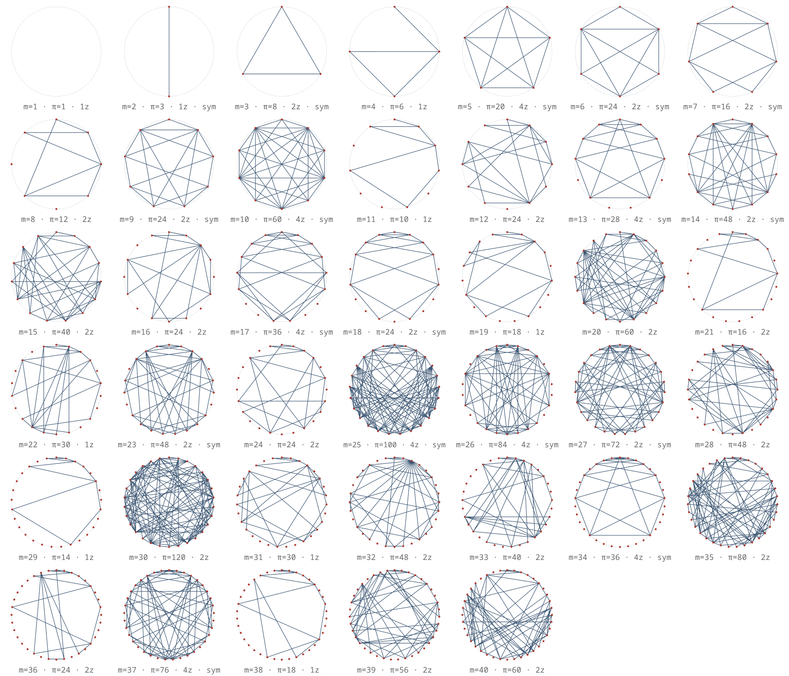
</picture>

Cobra CLI and a Bubble Tea v2 viewer; nothing else. Vendored, so it builds offline.

```
go build .        # -> ./pisano
go run . gallery
```

## What it draws

Every example below has a **▸** link beside it. They open the browser build and
run the command, so nothing has to be installed to see what it does.

**Circular designs.** Space m points evenly around a circle, label them with the
possible remainders, and join them in the order the remainders appear. Output is
SVG, one figure or a whole contact sheet.

```
go run . circle --mod 1-40 -o sheet.svg
go run . circle --mod 8,13,21,34,55,89 --cols 3 --cell 260 -o families.svg
```

▸ [the sheet](https://0magnet.github.io/pisano/?run=pisano%20circle%20--mod%201-40%20-o%20sheet.svg%20%26%26%20view%20sheet.svg)
· [the families](https://0magnet.github.io/pisano/?run=pisano%20circle%20--mod%208%2C13%2C21%2C34%2C55%2C89%20--cols%203%20--cell%20260%20-o%20families.svg%20%26%26%20view%20families.svg)

**Turtle paths.** Read each term as an instruction: odd turns left and steps
forward, even turns right and steps forward, zero does neither. Terminal text by
default, SVG or HTML with `--out`.

```
go run . turtle --mod 10                      # box-drawing characters
go run . turtle --mod 0                       # no modulus at all — the plus sign
go run . turtle --mod 25 --tint heading       # colored by which way it was facing
go run . turtle --mod 1-40 -o paths.svg       # vector
go run . turtle --mod 1-40 -o paths.html      # page of inline SVG
go run . turtle --mod 8,21,55 --split web/    # one file each, for a site
```

▸ [`--mod 10`](https://0magnet.github.io/pisano/?run=pisano%20turtle%20--mod%2010)
· [`--mod 0`](https://0magnet.github.io/pisano/?run=pisano%20turtle%20--mod%200)
· [`--tint heading`](https://0magnet.github.io/pisano/?run=pisano%20turtle%20--mod%2025%20--tint%20heading)
· [the vector sheet](https://0magnet.github.io/pisano/?run=pisano%20turtle%20--mod%201-40%20-o%20paths.svg%20%26%26%20view%20paths.svg)

**Watch it draw.** `tui` opens the designs in the alternate screen and animates
them. This is the one for paths that never close — see below.

```
go run . tui                       # fib mod 25, an open path, scrolling
go run . tui --mod 11              # a closed path, recoloring each lap
go run . tui --circle --mod 10     # trace the chords in sequence order
```

▸ [the open path](https://0magnet.github.io/pisano/?run=pisano%20tui)
· [the closed one](https://0magnet.github.io/pisano/?run=pisano%20tui%20--mod%2011)
· [the chords](https://0magnet.github.io/pisano/?run=pisano%20tui%20--circle%20--mod%2010)

**Everything at once.** `gallery` builds a single self-contained page holding
every figure the video walks through, in the order it introduces them, and
writes the same figures out as standalone SVG sheets.

```
go run . gallery                    # out/index.html + out/svg/*.svg
```

**The arithmetic itself**, if you just want the numbers:

```
$ go run . period --mod 10
fib mod 10: period 60, 4 zero(s)
  terms:  [0 1 1 2 3 5 8 3 1 4 5 9 4 3 7 0 7 7 4 1 5 6 1 7 8 5 3 8 1 9 ...]
```

▸ [the period](https://0magnet.github.io/pisano/?run=pisano%20period%20--mod%2010)
· [the sweep](https://0magnet.github.io/pisano/?run=pisano%20sweep%20--max%20300)

## Output formats

`--out` picks by extension: `.svg` writes one sheet, `.html` writes a page of
inline SVG, `-` writes SVG to stdout. `--split DIR` writes one file per figure,
which is what you want if the designs are going onto a site individually.

The terminal renderer is still there and still pipes to `ansifilter` if you want
the box-drawing look on a page:

```
go run . turtle --mod 10,25 | ansifilter -H -F "DejaVu Sans Mono" -s 10 > paths.html
```

That works, and it is how `tinygo-stuff/schematic.html` was made. It is the
wrong choice here, though. It gives you a `<pre>` of box-drawing glyphs, so the
figure depends on a font being present and correctly metric'd — which is why
that file carries 100 KB of base64 woff2 — it will not scale, and adjacent rows
show hairline gaps at most sizes. The native SVG has none of those problems and
is smaller. Use ansifilter when you specifically want the terminal's look;
use `--out` when you want the drawing.

## The viewer

The walk never finishes.

An **open path** drifts forever, so the camera follows its head and the oldest of
the drawing is dropped as it scrolls off the edge. The figure stays at its true
size rather than shrinking to fit — box-drawing characters at one lattice step
per row, joining up cleanly, however long it runs.

A **closed path** is simply walked again from where it left off. It retraces
exactly the same figure, so the geometry cannot change — but each circuit is
drawn in the next color, and the loop sweeps round instead of sitting there
done. Color is the only thing that can change on a closed figure, which is
precisely why it is worth changing.

**What a color means** is a choice, `--tint`, and each mode is a different
question about the same figure:

| mode | |
| --- | --- |
| `step` | what the path does to each piece of itself: forward through the palette each time a step is walked again the same way, back when it is walked against it. The default, and the only one under which a closed figure reliably changes when it is redrawn |
| `pass` | which walk of the period laid the step down |
| `visits` | how many times a step has been walked — these paths draw most of themselves twice |
| `heading` | which way the turtle was facing, four colors; the fourfold symmetry of a quarter-turn path becomes obvious |
| `turn` | left or right, which is odd or even: the arithmetic itself, drawn onto the figure |
| `term` | the residue that produced the step |
| `age` | how far into the circuit it is — a band of color traveling round a closed path |

```
go run . tui --mod 25            # open: scrolls
go run . tui --mod 11            # closed: recolors in place
go run . tui --trail comet       # a short tail chasing the head
go run . turtle --mod 10 --tint heading
```

| key | |
|---|---|
| `space` | play / pause |
| `← →` `h l` | modulus down / up (`H L` by ten) |
| `↑ ↓` `k j` | speed double / halve |
| `o` | jump to the next modulus whose path never closes |
| `t` | trail: whole circuit, long, short, comet |
| `0` | no modulus at all |
| `s` | next sequence · `[ ]` multiplier |
| `v` | turtle path or circular design |
| `m` | box-drawing characters or braille dots |
| `f` | camera: auto, fit, follow |
| `c` | what a color means: step, pass, visits, heading, turn, term, age, off |
| `r` `?` `q` | restart · help · quit |

**Camera** defaults to auto, because the right answer is not a matter of taste:
an open path has a head that runs away from you and the view has to keep up,
while a closed one wants to sit still and be looked at. Auto picks `fit` for a
closed path and `scroll` for an open one.

Three ways to keep up, in increasing order of how much they leave alone:

| `--cam` | |
|---|---|
| `follow` | pins the head to the center, so the whole drawing slides under it every frame |
| `scroll` | holds still until the head reaches a margin of the edge, then moves the least it can |
| `page` | same, but shoves the view most of a screen at a time — still for longer, then one jump |

Follow is exact and unwatchable: nothing on screen ever holds still, and the
head's wandering *within* a motif shakes the entire drawing. Under scroll that
wandering costs nothing — only the net drift moves the view, and only along the
axis it drifts on. Consecutive frames of the same walk:

```
follow                          scroll
     ┌─┬─┼─┼─┐                       ┌─┬─┼─┼─┐        cam -29,-6
     └─┼─┼─┼─┼─┐                     └─┼─┼─┼─┼─┐
     ┌─┤ ├─┤ └─┤                 ┌─╴ ┌─┤ ├─┤ └─┤
   ┌─┴─┘ └─┘ ┌─┼─┼─              └─┐ ┌─┼─┼─┘ └─┘

  ┌─┬─┼─┼─┐                          ┌─┬─┼─┼─┐        cam -29,-6
  └─┼─┼─┼─┼─┐                        └─┼─┼─┼─┼─┐
  ┌─┤ ├─┤ └─┤                    ┌─┐ ┌─┤ ├─┤ └─┤
┌─┴─┘ └─┘ ┌─┼─┼─                 ├─┤ ┌─┼─┼─┘ └─┘
   ^ the motif jumps                 ^ same place, new drawing only
```

**Trail** is how much stays on screen. `whole` keeps exactly one circuit for a
closed path — so the figure stands complete and still while the color moves
through it — and as much as memory allows for an open one. Shorter settings
leave a comet tail behind the head. Trimming runs in batches: each trim shifts
the slice down, so dropping one point per frame would copy the whole trail for
the sake of one element.

**Two renderers.** Box drawing is the default and is the figure at its true
size: one lattice step is one row or two columns, which is why the characters
join. It cannot zoom, so the camera is the only thing that moves and anything
outside the window is clipped — which is exactly what makes an endless path
watchable, since the drawing scrolls rather than shrinking.

Braille packs a 2x4 dot grid into every cell (`U+2800`), trading those joins for
an arbitrary scale, so it can keep shrinking as an open path drifts. It is also
the only one that can draw the circular designs at all, since those are chords
at arbitrary angles — press `v` to watch one trace itself chord by chord, in the
order the remainders actually appear, which the finished figure discards.

A braille dot is half a cell wide and a quarter tall, and a terminal cell is
roughly twice as tall as it is wide, so the dots come out very nearly square and
one scale serves both axes.

`--max-points` (60000) caps memory. At that size a redraw costs about 3.6 ms in
box mode and 7.8 ms in braille, against a 40 ms frame.

### Don't loop it from the shell

`--cycle 5s` steps through the moduli on its own. Use it rather than a shell
loop around the whole program:

```
go run . tui --cycle 5s --mod 1          # yes
seq 0 1000 | while read n; do timeout 5 ./pisano tui --mod $n; done   # no
```

A full-screen program takes the terminal over and puts it in **raw mode**, where
Ctrl-C is no longer a signal — it is a keystroke the program has to choose to
honor. In a loop that means each Ctrl-C ends one iteration and the shell
immediately starts the next, so a thousand of them takes a thousand interrupts
to escape. `tui` therefore refuses to start unless stdin and stdout are both
terminals.

### Why Bubble Tea v2

Bubble Tea v1 shipped a package `init()` that called `lipgloss.HasDarkBackground()`,
which asks the terminal for its background color (`OSC 11`) and waits up to
`termenv.OSCTimeout` — **five seconds** — for a reply. Because it was package
initialisation it ran before `main()`, so it stalled *every* command in the
binary, `period` and `gallery` included, on any terminal that does not answer.

v2 deletes the workaround along with its cause: no `init()` anywhere in the
module, and no dependency on lipgloss or termenv at all. Background color is an
ordinary opt-in command whose answer arrives as a message, so nothing blocks and
a terminal that never replies simply never sends one.

Measured on a terminal that does not answer:

| | v1.3.10 | v2.0.8 |
|---|---|---|
| `pisano period --mod 10` | 5.01 s | 0.01 s |
| `pisano --help` | 5.01 s | 0.01 s |
| `pisano gallery` | 5.04 s | 0.03 s |
| `pisano tui` | 12 bytes, drew nothing | draws immediately |
| terminal after `SIGTERM` | left raw: `ICANON=off ECHO=off` | fully restored |

The port also dropped lipgloss and termenv from the tree. The chrome is styled
with raw SGR codes now, which is what the canvas renderers were already doing.

## Sequences

`--seq fib` (default), `lucas`, `tri`, `nat`, `prime`. Nothing about either
construction is particular to Fibonacci — it is the ingredient the recipe is
usually made with, not the recipe.

`nat` is the plain number line, the reference case both constructions are
introduced against: its circular designs are regular polygons and its turtle
path is a staircase, because it alternates odd and even forever.

The primes are the instructive case: their residues never repeat, so no period
exists and the drawing is an open path rather than a closed figure. The code
does not assume periodicity; a sequence declares whether it has a finite state,
and one that does not never reports a period.

`--mul n` multiplies the Fibonacci sequence through by n. The plain designs then
reappear at every nth modulus with new ones interleaved between them, which is
the video's "design m/k" labelling: m is the modulus, n the multiplier. It is
not "mod m/n" — a modulus is always an integer.

## The open questions

The video notices two patterns it cannot account for. Both are testable, so
`sweep` tests them.

**Does the zero count predict symmetry?** Every Fibonacci Pisano period contains
one, two or four zeros. The video observes that four zeros always seem to give a
symmetrical design and one zero always an asymmetrical one, and says it would be
nice to know why.

```
$ go run . sweep --max 3000
ZEROS     SYMMETRIC    ASYMMETRIC
-----     ---------    ----------
1                 0           335
2               324          1981
4               358             0

no counterexamples: 4 zeros => symmetrical and 1 zero => asymmetrical
held for every modulus 3..3000
```

Not a proof. But a single counterexample would have settled it the other way,
and none turns up, which is worth knowing before anyone spends time proving it.

**What decides whether a turtle path closes?** The video sees that some paths
loop and others march off to infinity, and says it never looked into why. This
one does have an answer, and it needs no search.

One pass of the period is a rigid motion of the plane: turn through some whole
number of right angles, then translate. Repeating the period repeats that
motion, so the net turn decides everything.

| net turn | result |
|---|---|
| 90° or 270° | rotation about a fixed point — closes after 4 passes |
| 180° | rotation — closes after 2 passes |
| 0° | pure translation — closes only if the drift is also zero, otherwise open forever |

`Classify` reads this off a single pass without walking the path, and the test
suite checks its verdict against actually walking it for every modulus to 200.

**And in space?** The same argument works, and says more. Give the turtle a
third dimension — the parity of the term still picks left or right, and the
parity of the *next* term picks whether the turn is a yaw or a pitch. Reading
the pair is the point rather than a convenience: (Fₙ, Fₙ₊₁) mod *m* is the state
of the recurrence, and the Pisano period is the period of that pair, which is
why the period is the length it is.

One pass is still a rigid motion, but the heading now lives in the rotation
group of the cube instead of ℤ/4. Iterating (R, t) for k passes displaces by
(I + R + … + R^k⁻¹)t, and taking k to be the order of R makes that k times the
projection of t onto R's axis. So **the path closes exactly when the drift has
no component along the axis of rotation** — which reduces correctly, since in
the plane a non-trivial rotation fixes only the origin and every turning path
closes.

Space adds two outcomes the plane cannot have. A net turn *and* an axial drift
is a screw motion: the figure winds along its own axis forever. And element
orders in the rotation group of the cube are 1, 2, 3 and 4, so a path can close
after exactly **three** passes, from a rotation about a body diagonal.

`Classify3` and `Path3` in `pkg/pisano` do this; the tests check the prediction
against walking it, and pin the rule against a variant that takes both bits from
one term — which cannot use the third dimension at all at modulus 2, winds its
helices about the starting frame's own "up" axis, and comes out flatter. There
is no terminal renderer for it here; the figures are drawn by
[chaosrack](https://github.com/0magnet/chaosrack), whose **Turtle Path** mode
walks them in WebGL.

The video also notes that several moduli produce identical turtle designs.
`sweep --dupes` canonicalises each path up to position and orientation and groups
them:

```
$ go run . sweep --max 60 --dupes
43 distinct figures across 60 moduli
  4, 8
  6, 12, 16, 18, 24, 36, 48
  ...
```

## In the browser

The same designs, driven from a shell, compiled to WebAssembly:
**[0magnet.github.io/pisano](https://0magnet.github.io/pisano/)** — a desktop,
with the shell in one window and whatever it draws in another. TinyGo by
default; the [standard Go build](https://0magnet.github.io/pisano/go/) is linked
from the page header, as is the [gallery](https://0magnet.github.io/pisano/gallery/).

```
pisano:~$ pisano tui                                 the viewer, full screen
pisano:~$ pisano turtle --mod 25                     box drawing, in the shell
pisano:~$ pisano sweep --max 300                     the analysis
pisano:~$ pisano circle --mod 8,13,21,34 -o s.svg && view s.svg
```

That last line is the point of the window manager. There is no message passing
behind it: both windows are panes in one binary over one filesystem, so writing
the file *is* the hand-off and `view` only has to name it. The dependency points
pisano → [desk](https://github.com/0magnet/desk); desk knows nothing about
pisano, which is why the command lives in `web/app` and both binaries register
it.

### Linking to a command

`?run=` carries a command into the page. It is submitted once the shell is up,
as though typed — echoed after the prompt, added to the history, run — so what
ran is on the screen and not only in the address bar.

```
https://0magnet.github.io/pisano/?run=pisano+turtle+--mod+25
https://0magnet.github.io/pisano/?run=pisano+circle+--mod+8,13,21,34+-o+s.svg+%26%26+view+s.svg
https://0magnet.github.io/pisano/?run=first&run=second
```

One parameter is one line, and repeating it runs them in order. `&&` needs
encoding as `%26%26`, since a bare `&` separates parameters. The query string
rather than the fragment, because a fragment is never sent anywhere and these
are meant to be shared. Only the terminal the page opens with runs them; a
second terminal opened from the panel starts at a clean prompt.

It runs whatever it is given, in a shell over a filesystem that exists only in
the tab — but it is still a link that executes something, so read one before
clicking it, as you would any other.

The terminal and the shell are **[websh](https://github.com/0magnet/websh)** —
[xterm-go](https://github.com/0magnet/xterm-go), a real Bash interpreter, and a
virtual filesystem, all already compiled to wasm. So the pipes, globs, history
and tab completion are the shell's, and the figures are this package's,
unchanged.

**Selecting works** the way it does in a terminal: drag, double-click for a word
— a path counts as one, wrap and all — triple-click for a line, `Ctrl+Shift+C`
to copy, and right-click for a menu. That needed writing, because a browser's
own Copy acts on the document's selection and a terminal's is not one: it is a
range of buffer cells the renderer draws, with no DOM text behind it.

### One command tree, two hosts

The browser runs the *same* cobra tree the binary does, and the same
`tui.Model`. What differs is three answers the commands ask their host for —
where files go, where "here" is, and how to get a terminal for the viewer — and
those travel in the context, so two open terminals cannot answer with each
other's:

```go
type Host struct {
	Files     FileSystem            // the shell's filesystem, or the OS's
	Dir       func() string         // the shell's cwd, or the process's
	RunViewer func(tui.Options) error
}
```

Bubble Tea drives the viewer in both places. Upstream has no js/wasm port, so
there is a [fork](https://github.com/0magnet/bubbletea) whose `main` tracks
upstream and whose `wasm` branch carries two files — a resize listener that
waits on the context instead of on SIGWINCH, and a tty that admits there isn't
one. In the page it is handed its reader, writer, size and color profile rather
than asking a tty, since an `io.Pipe` cannot answer and would otherwise strip
every escape the model writes.

Two things do not survive the trip, and both are recorded where they bite:

- **TinyGo cannot execute `text/template`.** A template reaches its data by
  reflection and TinyGo panics on the first method call — `unimplemented:
  (reflect.Type).NumOut()`. cobra renders help by executing a template, so
  `pisano --help` took the shell's goroutine down with it. `pkg/flags` writes
  the help out directly instead, on both hosts, which also dropped four
  megabytes from the wasm.
- **A command tree built once is not ready to run twice.** Flag values live in
  the closures that registered them, and cobra copies the root's context onto a
  subcommand only if it has none. A process that runs one command and exits
  never notices; a browser runs a hundred in the same process. `commands.Run`
  resets both before every run.

Building it:

```
web/build.sh          # both      -> docs/ and docs/go/
web/build.sh tinygo   # TinyGo only                   4.9 MB
web/build.sh go       # standard Go only               16 MB
```

`web/` is a separate module. Keeping it out of the root one means the CLI's
dependencies stay at cobra and Bubble Tea, rather than dragging in a terminal
emulator and a shell interpreter for a build almost nobody makes.

## The figures

Every sheet below is produced by `pisano gallery`, which also writes them as
standalone SVG and builds [`docs/gallery/index.html`](docs/gallery/index.html)
holding the lot.
The images follow your system's light or dark setting.

### The number line, moduli 1–9

The reference case: reduced mod m the naturals cycle through every remainder in order, so the chords always close into a regular polygon.

<picture>
  <source media="(prefers-color-scheme: dark)" srcset="docs/img/nat-1-9-dark.png">
  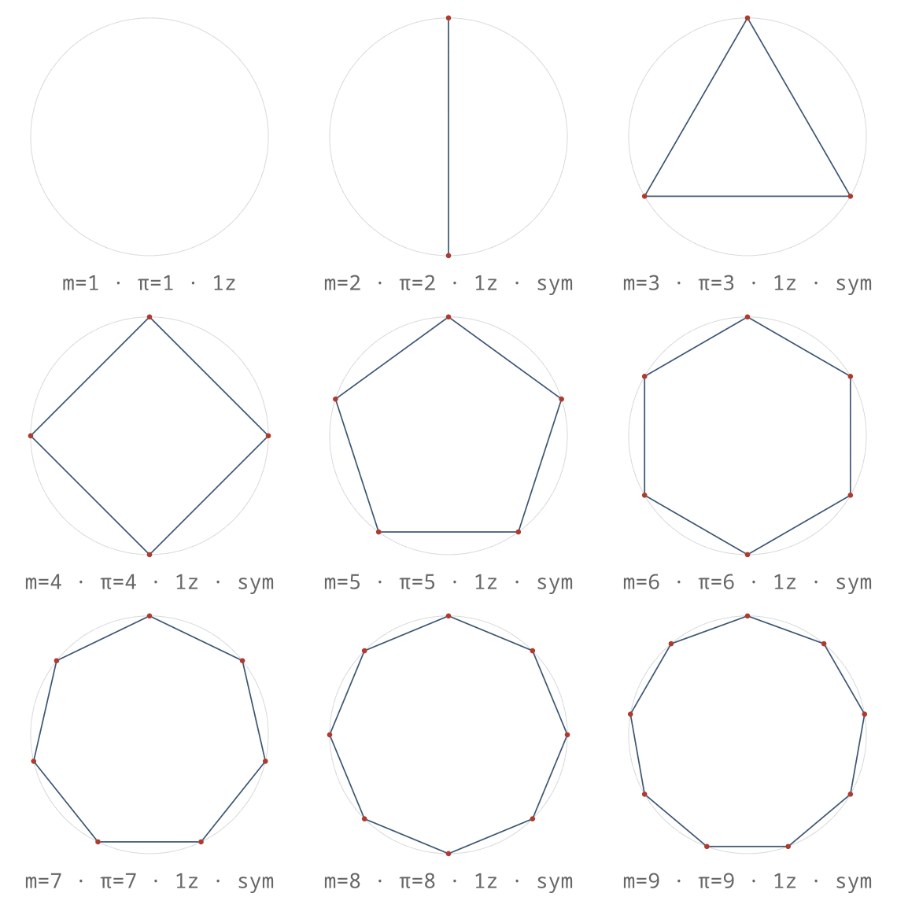
</picture>

<sub>[SVG](docs/svg/nat-1-9.svg)</sub>

### Fibonacci, moduli 1–9

The same construction on Fibonacci remainders. Mod 5 uses every possible chord; mod 6 keeps a mirror axis; mod 8 has none.

<picture>
  <source media="(prefers-color-scheme: dark)" srcset="docs/img/fib-1-9-dark.png">
  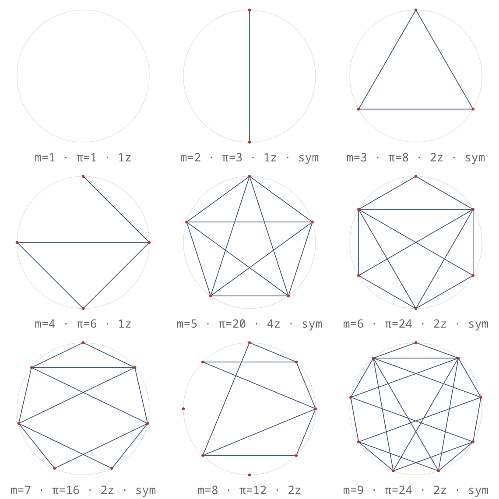
</picture>

<sub>[SVG](docs/svg/fib-1-9.svg)</sub>

### Fibonacci, modulus 10

A period of 60 — far more chords than its neighbors, and still symmetrical.

<picture>
  <source media="(prefers-color-scheme: dark)" srcset="docs/img/fib-10-dark.png">
  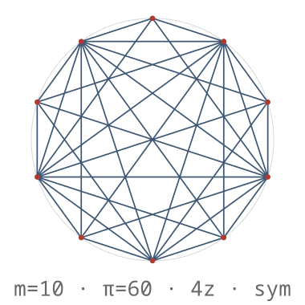
</picture>

<sub>[SVG](docs/svg/fib-10.svg)</sub>

### Fibonacci moduli 8, 21, 55

Near-duplicates of one another. All three moduli are Fibonacci numbers, all three periods hold two zeros, none is symmetrical.

<picture>
  <source media="(prefers-color-scheme: dark)" srcset="docs/img/fib-family-a-dark.png">
  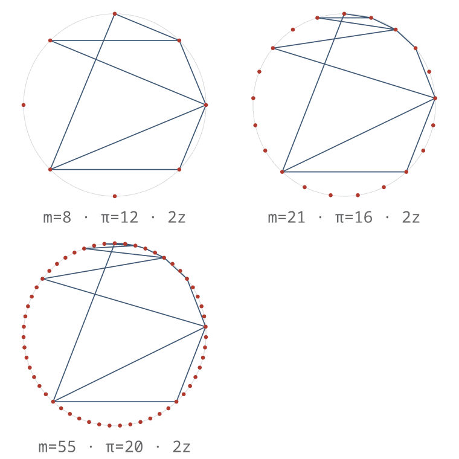
</picture>

<sub>[SVG](docs/svg/fib-family-a.svg)</sub>

### Fibonacci moduli 13, 34, 89

The other family, alternating with the first down the Fibonacci numbers. Four zeros each, symmetrical each.

<picture>
  <source media="(prefers-color-scheme: dark)" srcset="docs/img/fib-family-b-dark.png">
  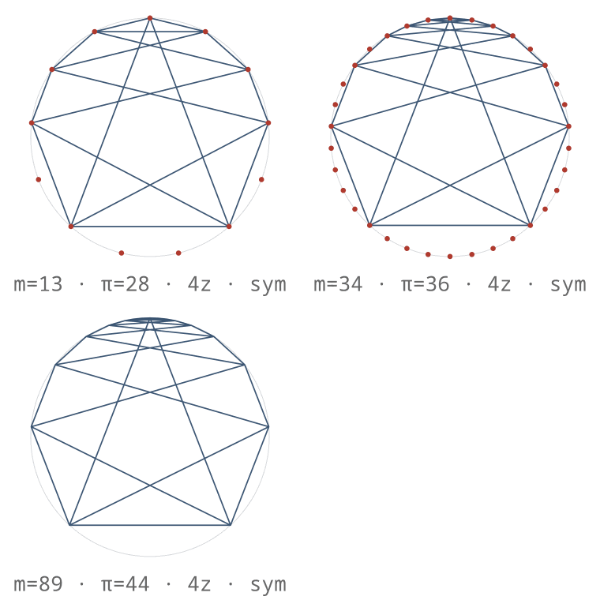
</picture>

<sub>[SVG](docs/svg/fib-family-b.svg)</sub>

### Lucas moduli 7, 18, 47

The same splitting into two families happens to the Lucas numbers, at moduli that are themselves Lucas numbers.

<picture>
  <source media="(prefers-color-scheme: dark)" srcset="docs/img/lucas-family-a-dark.png">
  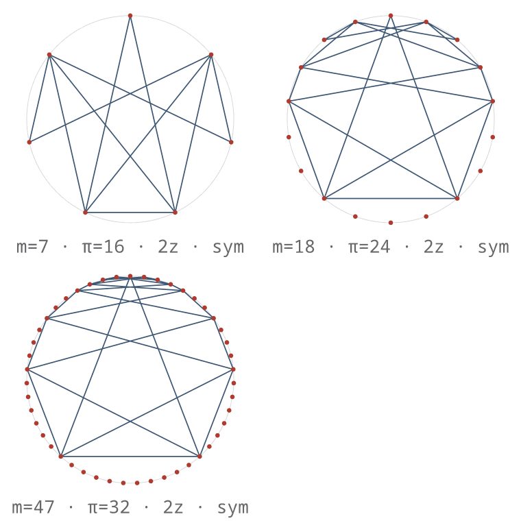
</picture>

<sub>[SVG](docs/svg/lucas-family-a.svg)</sub>

### Lucas moduli 11, 29, 76

The second Lucas family.

<picture>
  <source media="(prefers-color-scheme: dark)" srcset="docs/img/lucas-family-b-dark.png">
  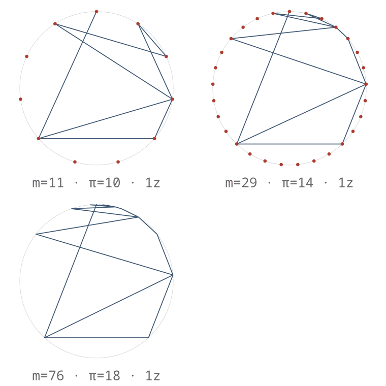
</picture>

<sub>[SVG](docs/svg/lucas-family-b.svg)</sub>

### Five sequences, all at modulus 10

Fibonacci, Lucas, triangular, the naturals and the primes. Fibonacci is the ingredient, not the recipe — and the primes never repeat, so there is no loop to close.

<picture>
  <source media="(prefers-color-scheme: dark)" srcset="docs/img/sequences-10-dark.png">
  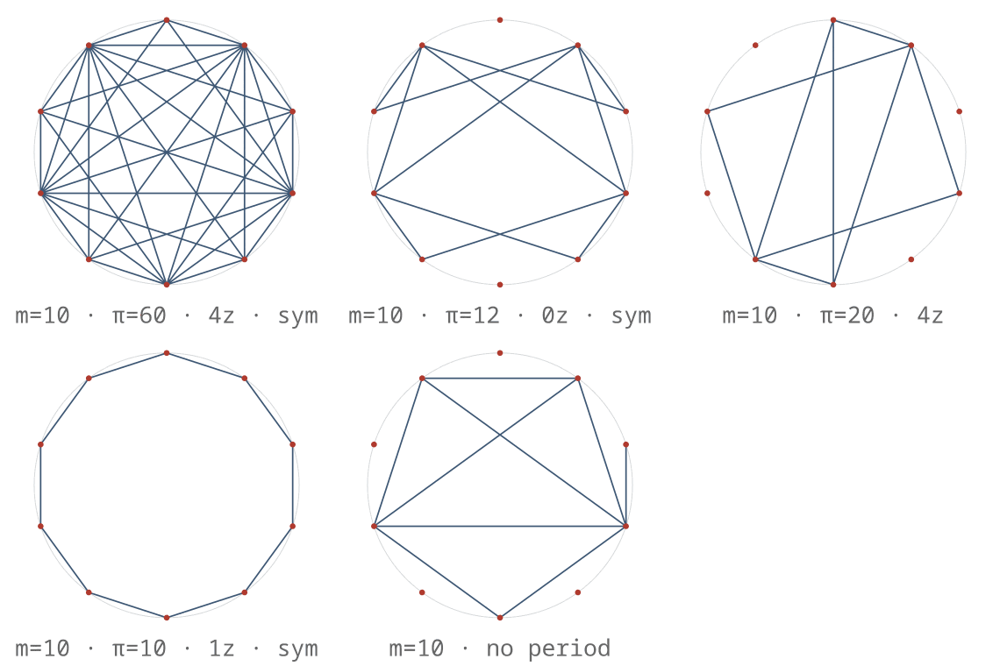
</picture>

<sub>[SVG](docs/svg/sequences-10.svg)</sub>

### Fibonacci × 2, moduli 1–24

Multiplying the sequence through by 2 makes the plain designs reappear at every 2nd modulus, with new ones interleaved.

<picture>
  <source media="(prefers-color-scheme: dark)" srcset="docs/img/fib-x2-1-24-dark.png">
  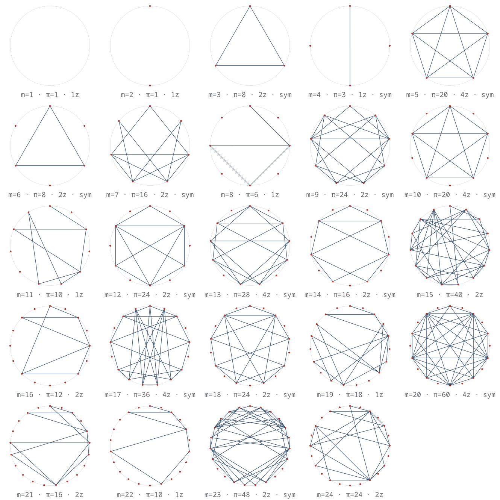
</picture>

<sub>[SVG](docs/svg/fib-x2-1-24.svg)</sub>

### Fibonacci × 3, moduli 1–24

Every 3rd modulus, and so on — the "design m/k" labelling.

<picture>
  <source media="(prefers-color-scheme: dark)" srcset="docs/img/fib-x3-1-24-dark.png">
  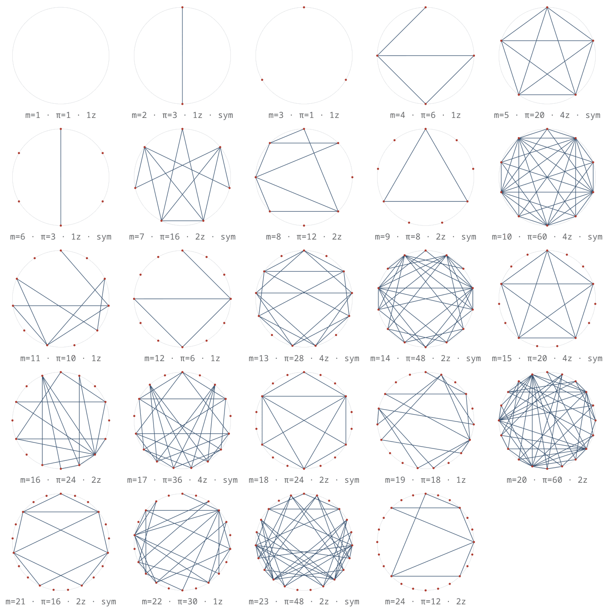
</picture>

<sub>[SVG](docs/svg/fib-x3-1-24.svg)</sub>

### Fibonacci × 4, moduli 1–24

Every 4th. The designs of ×2 show up at every other one of these.

<picture>
  <source media="(prefers-color-scheme: dark)" srcset="docs/img/fib-x4-1-24-dark.png">
  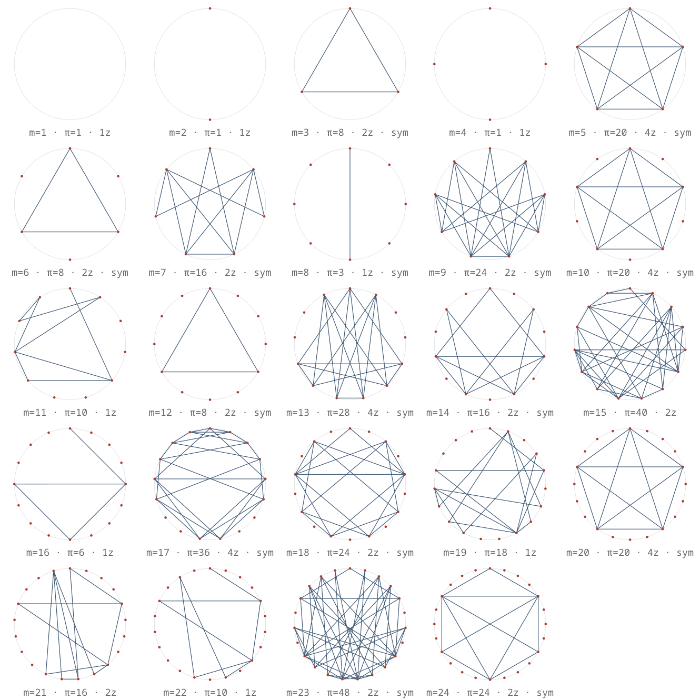
</picture>

<sub>[SVG](docs/svg/fib-x4-1-24.svg)</sub>

### Fibonacci, moduli 1–40

The contact sheet. Length alone does not decide whether a figure comes out symmetrical — the zero count does.

<picture>
  <source media="(prefers-color-scheme: dark)" srcset="docs/img/fib-1-40-dark.png">
  
</picture>

<sub>[SVG](docs/svg/fib-1-40.svg)</sub>

### Fibonacci, moduli 41–80

Further out, where the near-duplicate families keep recurring.

<picture>
  <source media="(prefers-color-scheme: dark)" srcset="docs/img/fib-41-80-dark.png">
  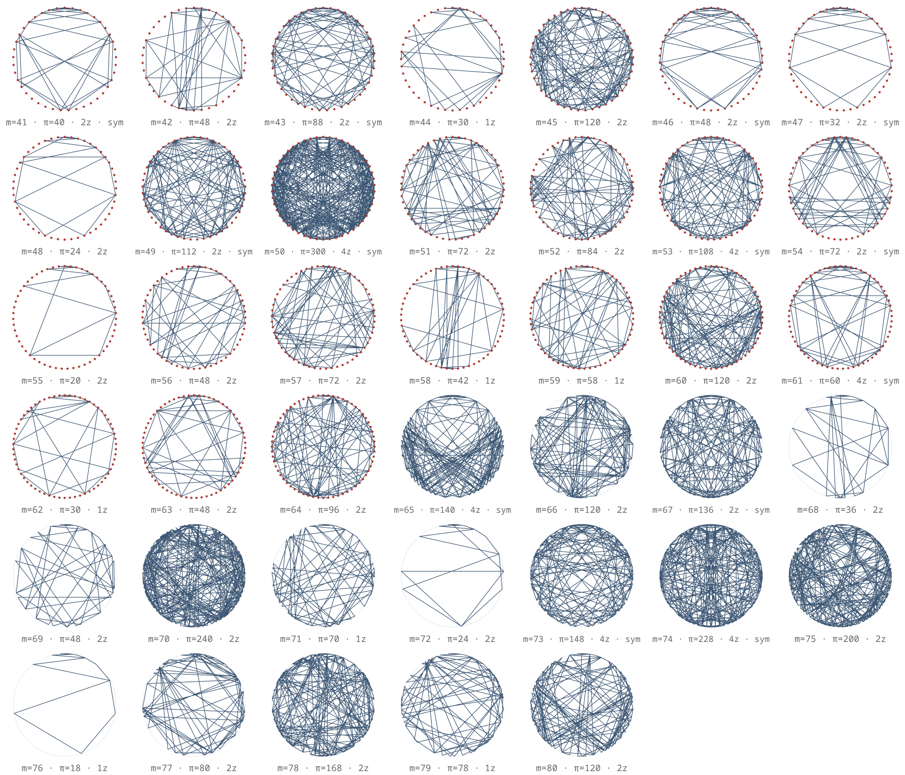
</picture>

<sub>[SVG](docs/svg/fib-41-80.svg)</sub>

### Turtle paths with no modulus at all

The naturals make a staircase. Fibonacci runs odd, odd, even — left, left, right — and closes into something that looks like a plus sign.

<picture>
  <source media="(prefers-color-scheme: dark)" srcset="docs/img/turtle-unreduced-dark.png">
  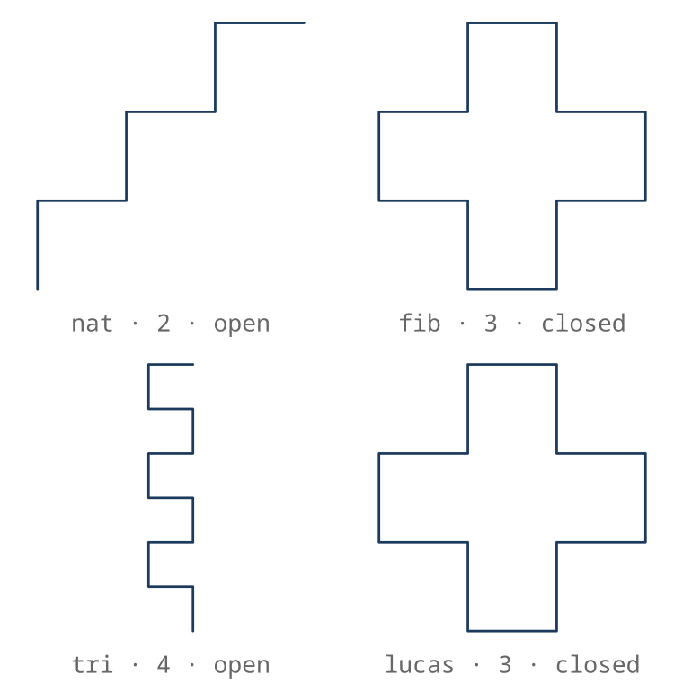
</picture>

<sub>[SVG](docs/svg/turtle-unreduced.svg)</sub>

### Fibonacci turtle paths, moduli 1–40

Now the remainders drive the turns. Some close; others repeat a motif off to infinity, drawn here for three passes.

<picture>
  <source media="(prefers-color-scheme: dark)" srcset="docs/img/turtle-fib-1-40-dark.png">
  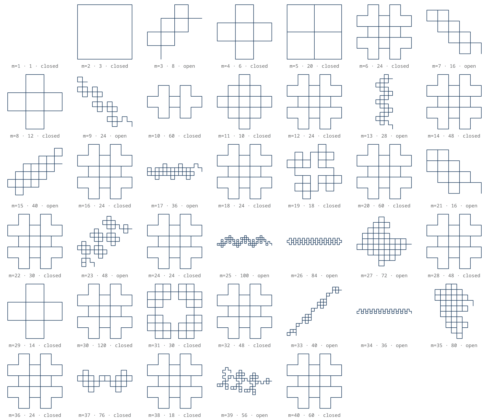
</picture>

<sub>[SVG](docs/svg/turtle-fib-1-40.svg)</sub>

### Fibonacci turtle paths, moduli 41–80

The same, further out.

<picture>
  <source media="(prefers-color-scheme: dark)" srcset="docs/img/turtle-fib-41-80-dark.png">
  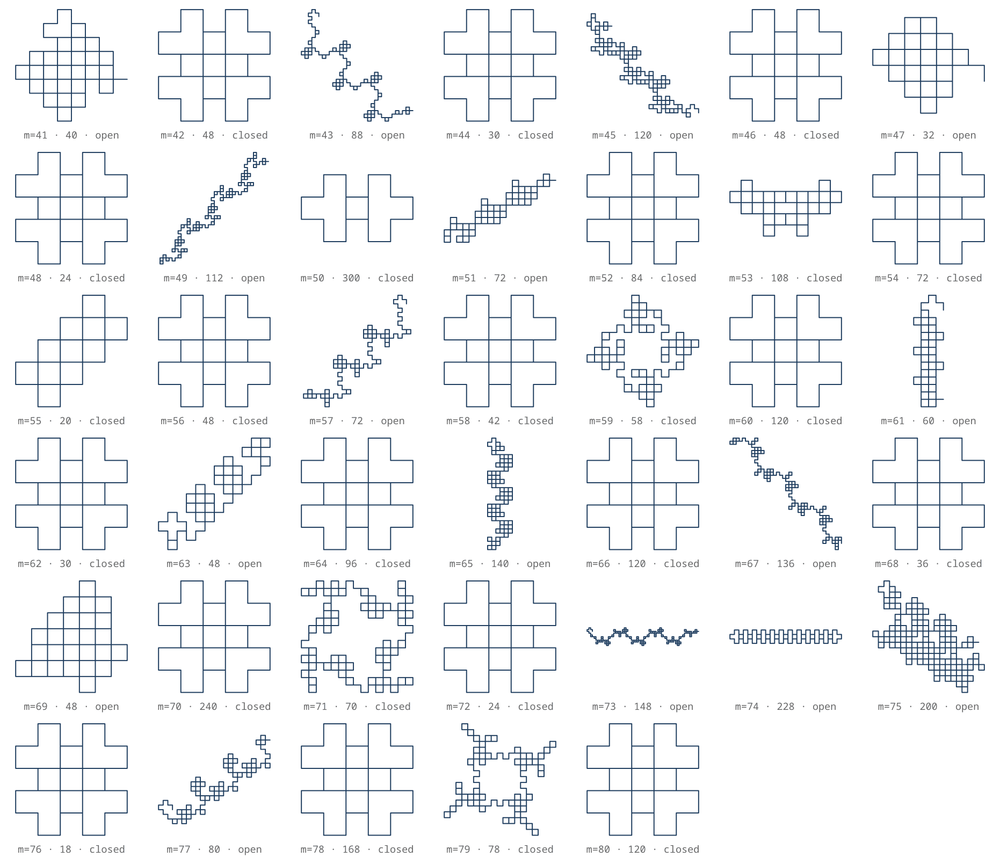
</picture>

<sub>[SVG](docs/svg/turtle-fib-41-80.svg)</sub>

### Turtle paths shared between moduli

6, 12, 16, 18, 24, 36 and 48 all draw one figure; 14, 28, 32, 42 and 46 draw another.

<picture>
  <source media="(prefers-color-scheme: dark)" srcset="docs/img/turtle-twins-dark.png">
  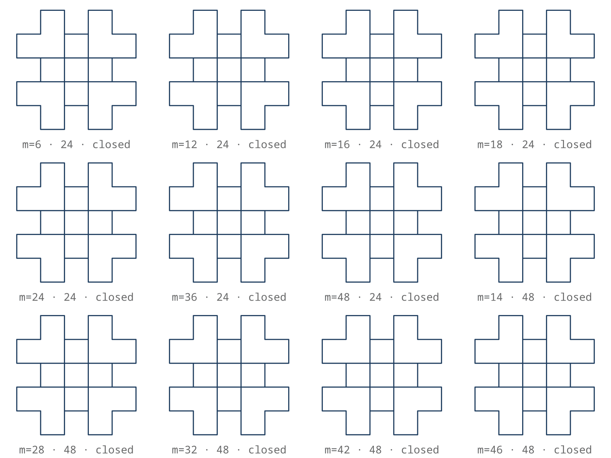
</picture>

<sub>[SVG](docs/svg/turtle-twins.svg)</sub>

### Lucas turtle paths, moduli 1–24

The same walk over a different sequence.

<picture>
  <source media="(prefers-color-scheme: dark)" srcset="docs/img/turtle-lucas-1-24-dark.png">
  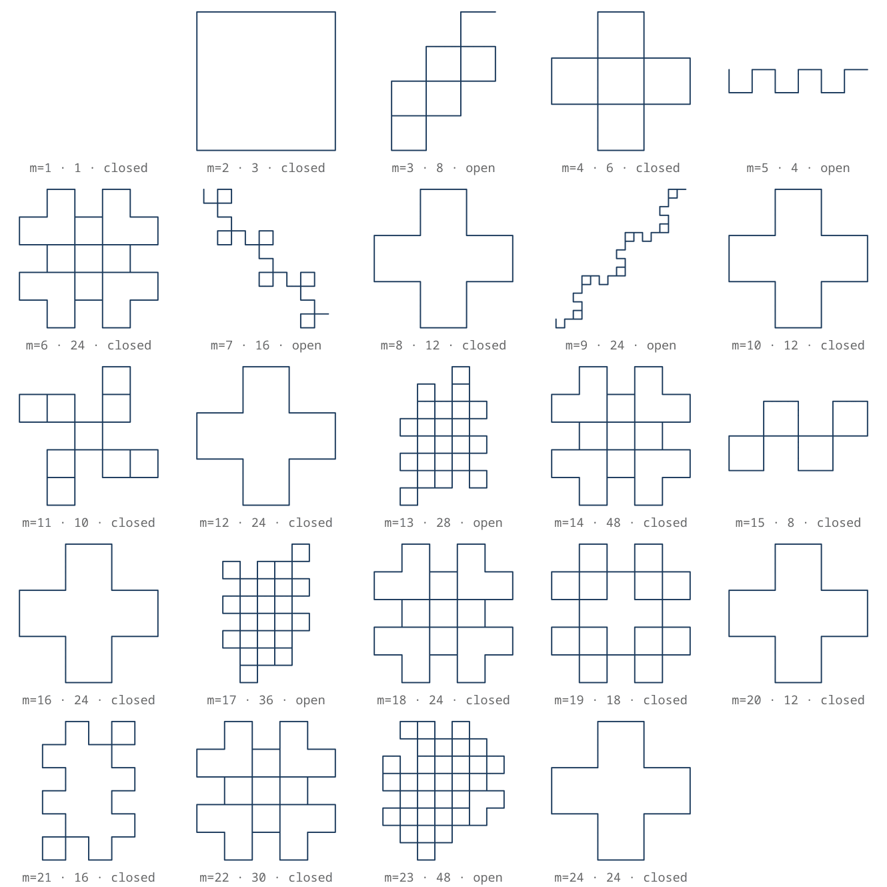
</picture>

<sub>[SVG](docs/svg/turtle-lucas-1-24.svg)</sub>

### Triangular turtle paths, moduli 1–24

And over the triangular numbers, whose rule for making terms has nothing to do with the other two.

<picture>
  <source media="(prefers-color-scheme: dark)" srcset="docs/img/turtle-tri-1-24-dark.png">
  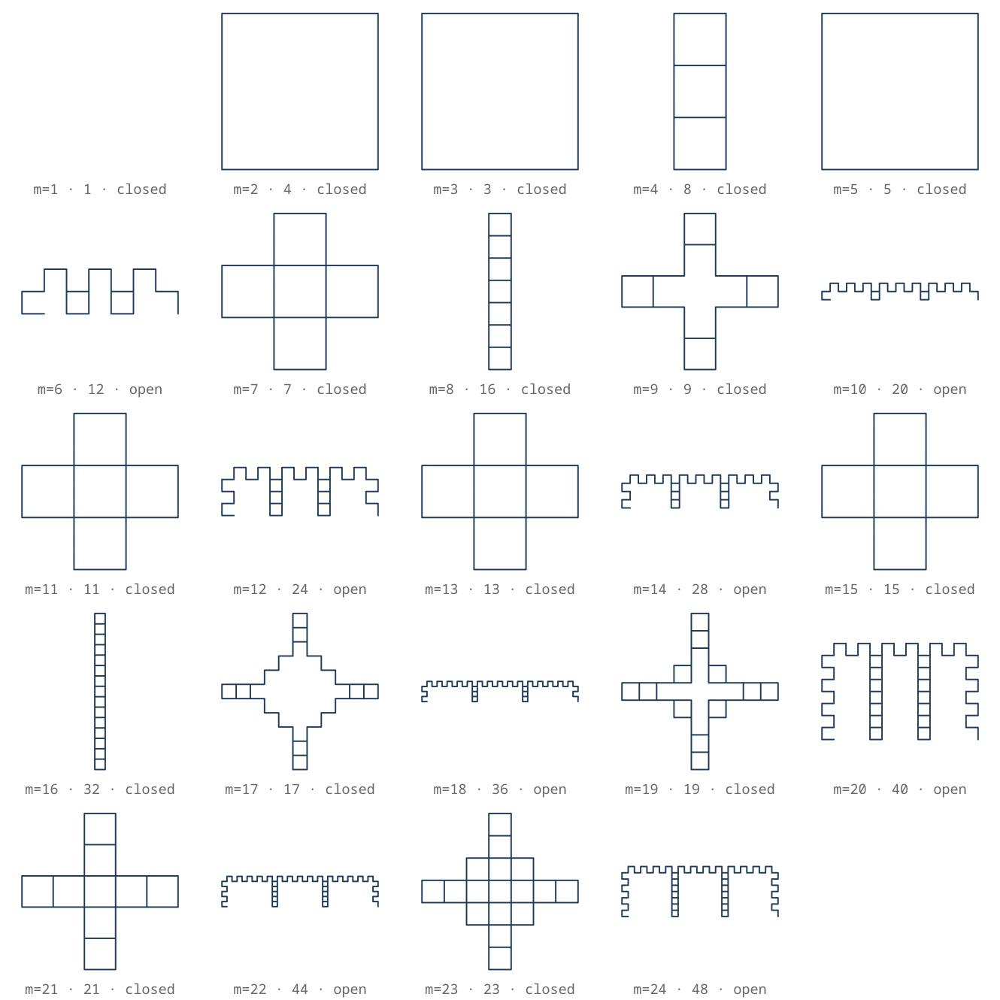
</picture>

<sub>[SVG](docs/svg/turtle-tri-1-24.svg)</sub>

## Layout

A thin `package main` at the repo root, the CLI as
a cobra tree under `cmd/`, and the actual work in `pkg/`.

```
pisano.go                     package main — wires up styling, calls Execute
cmd/pisano/commands/          the cobra tree: root, period, circle, turtle,
                              sweep, tui, gallery, and the Host the commands
                              ask for a filesystem, a cwd and a terminal
pkg/flags/                    the help screen, written out rather than templated
pkg/pisano/                   the library — no CLI, no cobra, no bubbletea
pkg/tui/                      the bubbletea viewer
web/                          a separate module: the same tree as a websh
                              applet, and the desk binary the page runs
docs/                         what GitHub Pages serves: the desktop at the
                              root, the standard Go build under go/, the
                              gallery under gallery/
```

`RootCmd` is exported, so the whole tree can be grafted onto another binary's
root command the way skywire composes its subcommands.

## Design

`Period` is the only thing the renderers see, so a drawing cannot disagree with
the arithmetic it came from. Everything else is a consequence:

- `pisano.go` — sequences and period detection. Cycles are found by generator
  state, not by assuming a recurrence, which is what lets the primes honestly
  report no period instead of a wrong one.
- `unreduced.go` — reading a sequence with no modulus. This is *not* the same as
  reducing mod 2: mod 2 sends every even term to the residue 0, which the turtle
  reads as "stay", while unreduced only a genuine zero stays. Fibonacci
  unreduced gives the left, left, right cycle behind the plus-sign figure; mod 2
  gives something else. Parity is tracked separately from value so that
  saturating the values (a Fibonacci number outruns int64 in ninety terms) never
  costs accuracy — the only question ever asked of the value is whether it is
  zero.
- `design.go` — chords and the symmetry tests.
- `sheet.go` — tiles, sheets and the HTML page. Both renderers emit a `Tile`,
  which is what lets circular designs and turtle paths share a sheet and go to
  SVG or HTML without either renderer knowing which.
- `svg.go`, `turtlesvg.go` — vector renderers.
- `canvas.go`, `braille.go`, `turtle.go` — the walk and the two terminal
  renderers.

### Why SVG for the circles and both for the turtle

The circular designs are chords at arbitrary angles. A character grid cannot
hold them, and a plotting library cannot draw them at all: plotting draws y as a
function of x, so a line can never double back.

Turtle paths are axis-aligned unit steps on a lattice, which is exactly what box
drawing characters are for — so they get a terminal renderer as well. The two
draw the same walk from the same points. The terminal one is bound to a
character grid, so a horizontal unit has to span two cells; the vector one
scales the lattice to whatever box it is given.

### canvas.go

Adapted from the wire canvas in `tinygo-stuff/schematic`, with three changes:

- **A cell stores which of its four edges carry track, not a finished glyph.**
  The original resolved a corner at the moment it drew one, which cannot express
  a path crossing its own earlier self — and these paths do that constantly. All
  sixteen edge combinations have a glyph, so T-junctions and crossings come out
  right where the original's `elbow` had no name for them and fell back to a
  placeholder.
- **The origin can be negative.** A turtle wanders wherever it likes, so the
  canvas is told its bounds up front and translates into them.
- **A horizontal unit spans two columns**, because terminal cells are about
  twice as tall as they are wide and a one-for-one grid comes out squashed.

None of the original's terminal-cursor interrogation came along. That existed
because asciigraph emits uneven-width ANSI output and the drawing had to ask the
terminal where the cursor had ended up; a canvas that knows its own cells has
nothing to ask.
## Dependency Graph

Made with [goda](https://github.com/loov/goda):

```
# GOOS=js: the import edges of a wasm program live in js/wasm-tagged
# files and are invisible to a host-context run
GOOS=js GOARCH=wasm go run github.com/loov/goda@latest graph github.com/0magnet/pisano/... | dot -Tsvg -o docs/pisano-goda-graph.svg
```

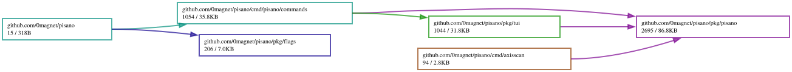

## Lines of Code

Made with [gocloc](https://github.com/hhatto/gocloc) (excludes `vendor/`, `node_modules/`, `.git/`):

```
gocloc --not-match-d='(vendor|node_modules|\.git)' .
```

```
-------------------------------------------------------------------------------
Language                     files          blank        comment           code
-------------------------------------------------------------------------------
Go                              47            765           1432           6019
HTML                             6              0              5           4471
JavaScript                       2            117             82            935
Markdown                         1            196              0            603
YAML                             1              0              7             98
JSON                             2              0              0             68
Makefile                         1             14             21             55
Bourne Shell                     2             13             27             51
-------------------------------------------------------------------------------
TOTAL                           62           1105           1574          12300
-------------------------------------------------------------------------------
```
